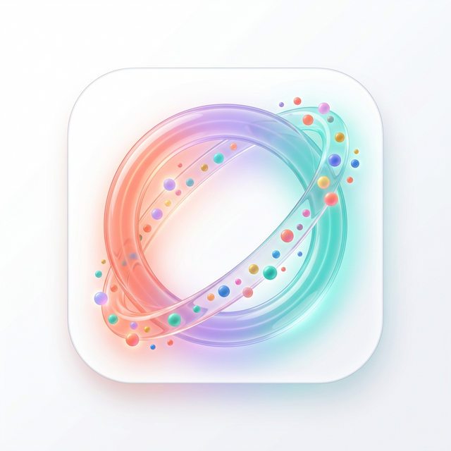

# 🌐 ORBIT — Connect Offline. Live More.

<p align="center">
  
</p>

<p align="center">
  <strong>ORBIT</strong> is a social platform that helps you discover real-world connections, local events, and communities — all designed to get you off your screen and into the moment.
</p>

<p align="center">
  <a href="#features">Features</a> •
  <a href="#tech-stack">Tech Stack</a> •
  <a href="#getting-started">Getting Started</a> •
  <a href="#deployment">Deployment</a> •
  <a href="#analytics-dashboard">Analytics</a>
</p>

---

## ✨ Features

- **Premium Landing Page** — Dark-themed, glassmorphic design with smooth GSAP animations
- **Light / Dark Mode** — Seamless theme toggle with system preference detection
- **Waitlist System** — Email + city collection powered by Supabase
- **Analytics Dashboard** — Secured admin panel with real-time waitlist analytics
  - Growth charts (Recharts)
  - City distribution pie chart
  - Global SVG heatmap with pulsing markers
  - Recent signups table with search
  - System health monitoring
- **Responsive Design** — Fully optimized for desktop, tablet, and mobile
- **SEO Optimized** — Semantic HTML, proper heading hierarchy, meta tags

## 🛠 Tech Stack

| Layer | Technology |
|---|---|
| **Frontend** | React 19, Vite 7, GSAP |
| **Styling** | Vanilla CSS with custom design tokens |
| **Charts** | Recharts |
| **Backend** | Node.js, Express 5 |
| **Database** | Supabase (PostgreSQL) |
| **Auth** | Backend-secured admin login |
| **Hosting** | Render |

## 🚀 Getting Started

### Prerequisites

- Node.js 18+
- npm

### Installation

```bash
# Clone the repository
git clone https://github.com/venkateshkamath/orbit-landing.git
cd orbit-landing

# Install dependencies
npm install
```

### Development

Run both the Vite dev server and Express backend:

```bash
# Terminal 1 — Backend API
npm run server

# Terminal 2 — Frontend (Vite dev server with API proxy)
npm run dev
```

The frontend runs on `http://localhost:5173` with API requests proxied to `http://localhost:3001`.

### Production Build

```bash
npm run build    # Build the frontend
npm start        # Serve everything from Express
```

## 🌍 Deployment

This project is configured for **Render** (one-service deployment):

| Setting | Value |
|---|---|
| Build Command | `npm install && npm run build` |
| Start Command | `npm start` |

### Environment Variables

| Key | Description |
|---|---|
| `SUPABASE_URL` | Your Supabase project URL |
| `SUPABASE_KEY` | Your Supabase anon/public key |
| `ADMIN_USER` | Admin dashboard username |
| `ADMIN_PASS` | Admin dashboard password |
| `NODE_ENV` | Set to `production` |

## 📊 Analytics Dashboard

Access the admin dashboard at `/orbit-admin` (not linked from the main site for security).

**Features:**
- Total waitlist count & growth velocity
- City distribution with donut chart
- Interactive SVG world heatmap
- Searchable signups table with join dates
- Real-time system health metrics

## 📁 Project Structure

```
orbit-landing/
├── server.js              # Express API + static file serving
├── vite.config.js         # Vite config with dev proxy
├── package.json
├── index.html
├── public/                # Static assets
│   ├── orbit-icon.png
│   ├── orbit-hero.png
│   └── feature-*.png
└── src/
    ├── main.jsx           # App entry point
    ├── App.jsx            # Router & layout
    ├── styles/
    │   └── index.css      # Design system & global styles
    └── components/
        ├── Navbar.jsx/css
        ├── Hero.jsx/css
        ├── Features.jsx/css
        ├── HowItWorks.jsx/css
        ├── Community.jsx/css
        ├── FAQ.jsx/css
        ├── Waitlist.jsx/css
        ├── WaitlistModal.jsx/css
        ├── Footer.jsx/css
        ├── ThemeToggle.jsx/css
        ├── Login.jsx/css
        └── Dashboard.jsx/css
```

## 🎨 Design System

ORBIT uses a custom design system with CSS variables:

- **Background**: `#0F0F1A` (Midnight) / `#FAFAFA` (Light)
- **Cards**: `#1C1C2E` / `#FFFFFF`
- **Accent Coral**: `#FF6B6B`
- **Accent Lavender**: `#C4B5FD`
- **Accent Teal**: `#5EEAD4`
- **Font**: [Outfit](https://fonts.google.com/specimen/Outfit) (headings) + System (body)
- **Brand Gradient**: Coral → Lavender → Teal

---

<p align="center">
  Built with ❤️ for real-world connections
</p>
